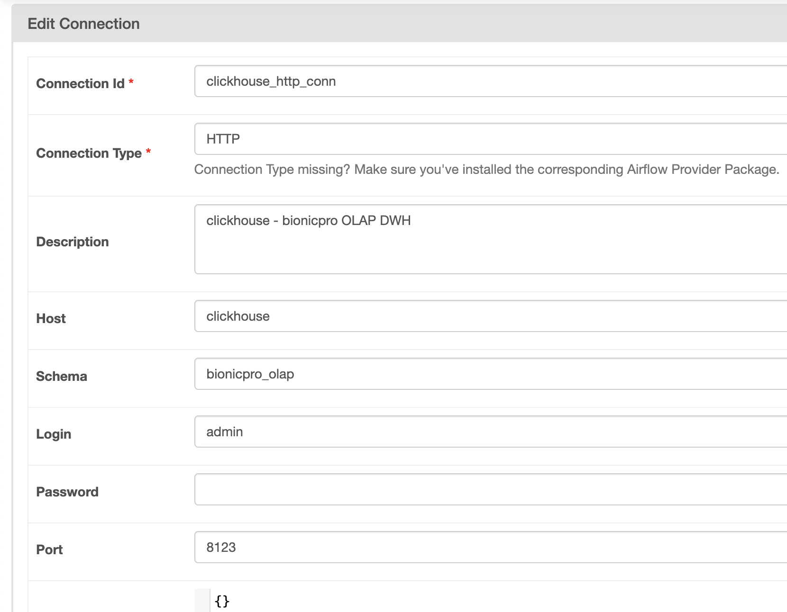
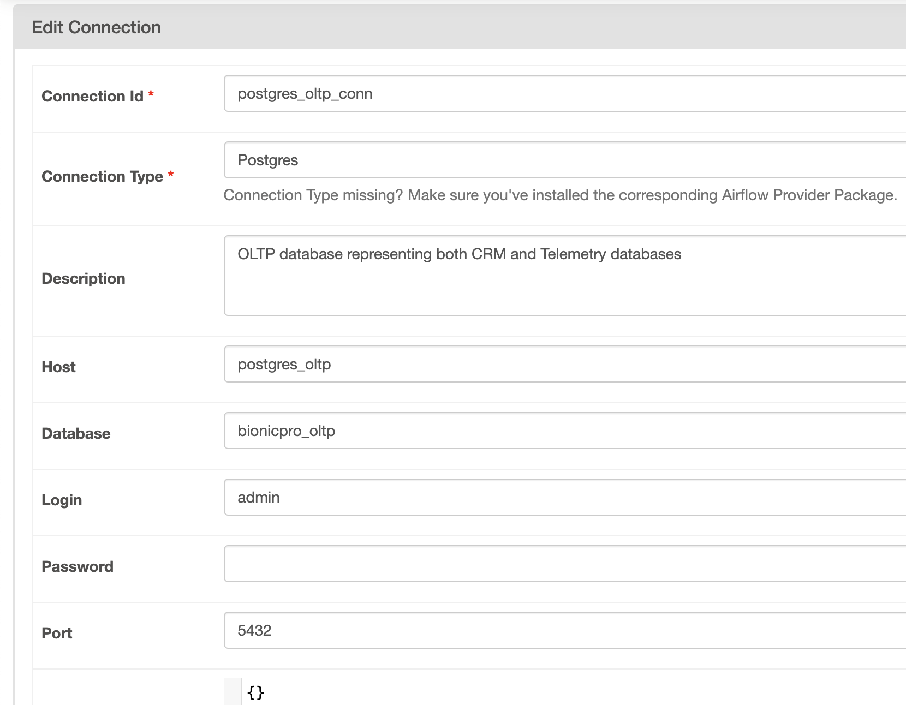
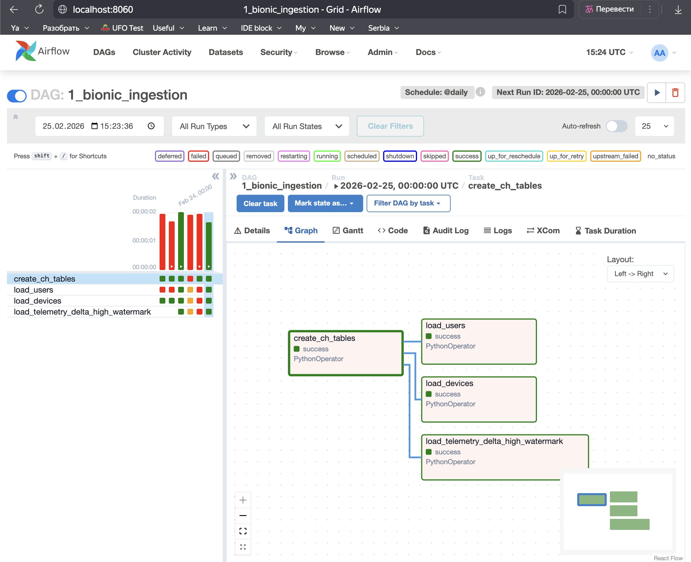
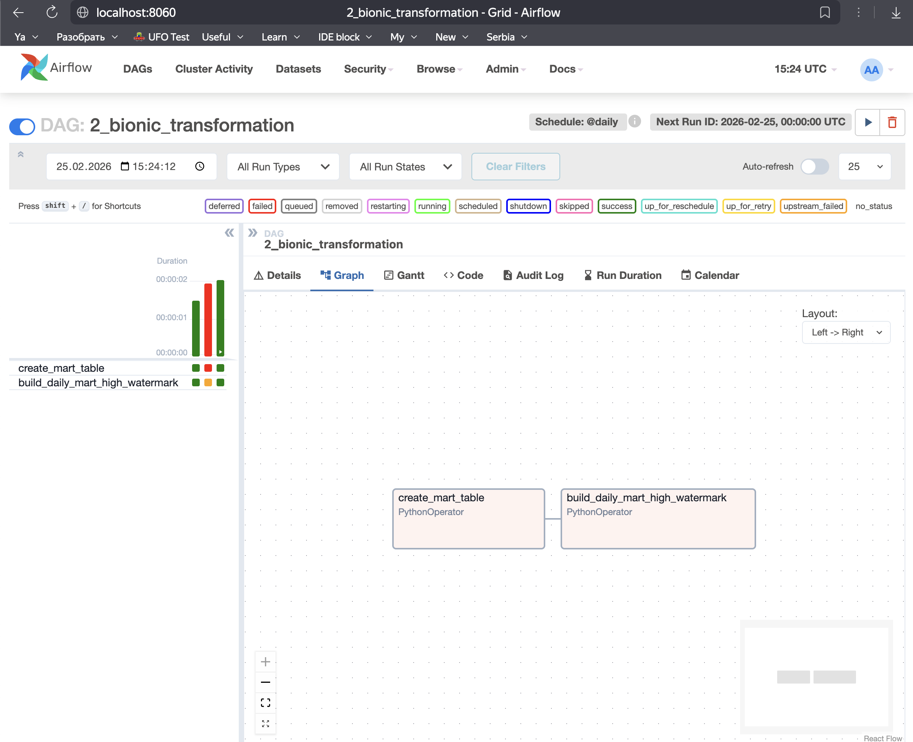
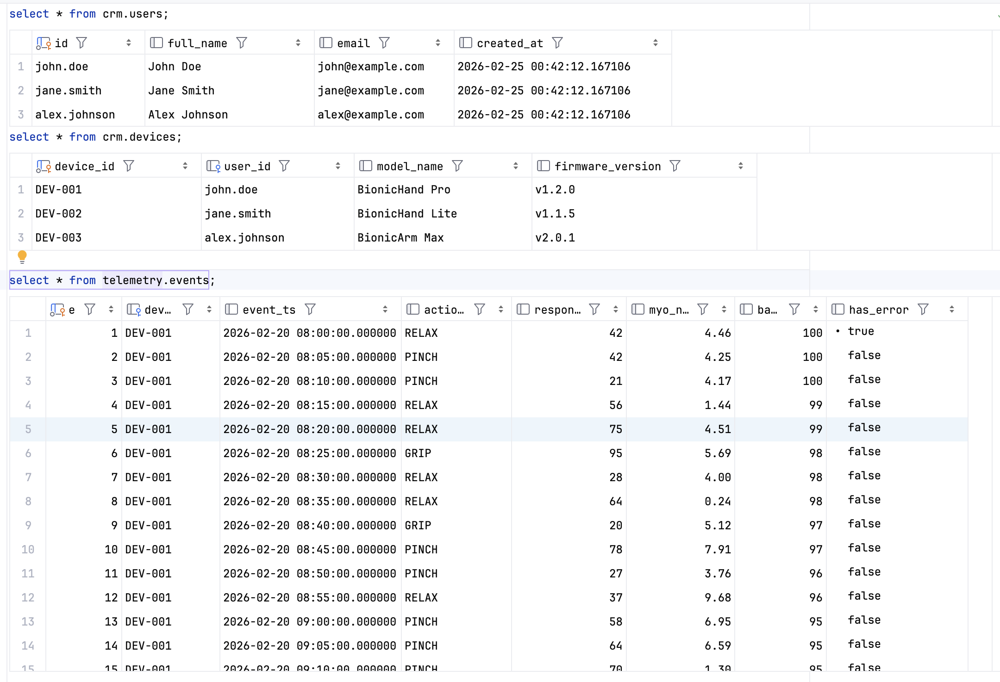
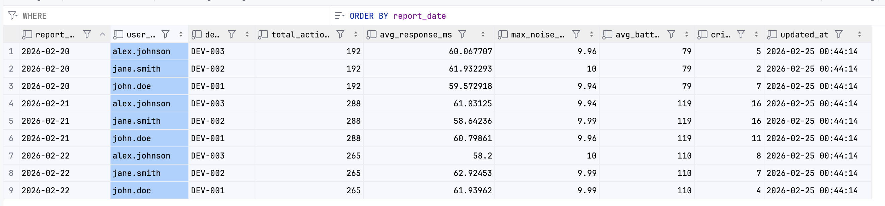
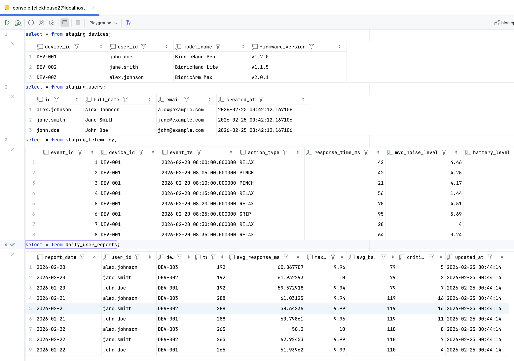
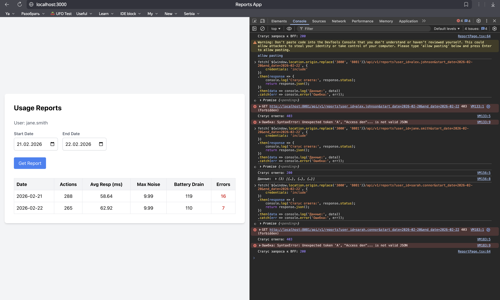
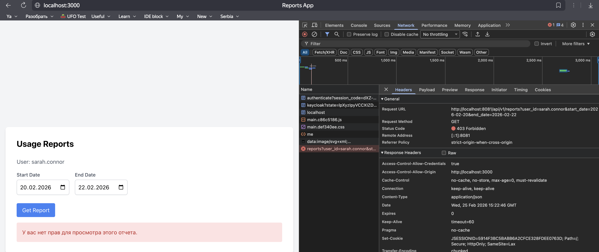

# Задание 2. Разработка сервиса отчётов
> Пользователи хотят, чтобы у них была возможность получать данные о работе своего протеза и просматривать их в виде отчёта.
>
> Вам нужно написать отдельный сервис для отчётов. Он будет генерировать отчёты из данных, которые собираются из разных источников, — CRM и DB.
>
>### **Перед отправкой задания**
>
>Не забудьте проверить, что:
>
>* UI-код позволяет вызвать API для генерации отчётов.
>* Реализация не позволяет генерировать отчёт пользователю, который не прошёл аутентификацию.
>* Реализация позволяет генерировать авторизованному пользователю только собственный отчёт.
>* Вы добавили в сервис отчётов их генерацию по запросу пользователя из OLAP: приложение должно отправлять запросы в OLAP базу для получения отчётов.
>* Вы предусмотрели генерацию отчётов только за период, который уже обработан Airflow. Обратите внимание, что пользователь может запросить данные, которых ещё нет в OLAP.


### Часть 1. Задача 1. Создать архитектуру решения для подготовки и получения отчётов
>Решение должно включать в себя ETL-процесс, который объединяет данные с датчиков и данные из CRM, используя Apache Airflow, и формирует готовую витрину отчётности в OLAP БД. Итоговый отчёт по пользователю должен быть доступен через бэкенд-сервис API, который обозначен на исходной архитектуре.
>
>Для подготовки архитектуры решения используйте [draw.io](http://draw.io).


### 1.1. ADR 07: стратегия пайплайна данных BionicPro и выбор OLAP хранилища
**Контекст:**
- Текущая архитектура BionicPro использует две независимые базы данных PostgreSQL в качестве источников (OLTP);
  - **CRM**: содержит профили пользователей и метаданные;
  - **Telemetry**: хранит сырые логи активности протезов, поток в сотни тысяч записей в сутки с возомжностью роста;
- Бизнес-задача требует формирования аналитических отчетов, объединяющих данные из обеих баз (например, отчет по активности конкретного пользователя из CRM на основе данных из Telemetry). 
- Выполнение тяжелых `JOIN` запросов между разными БД в реальном времени невозможно, а выполнение их в `Telemetry-DB` приведет к деградации производительности основной системы.

**Решение:**
1. **Внедрение OLAP (ClickHouse)**: создать центральное аналитическое хранилище по архитектуре DWH. Данные из двух Postgres-источников копируются в слой **Staging**, а затем объединяются в витрины данных (**Data Marts**).
2. **Использование ELT вместо ETL**: выполнять трансформации (мердж CRM и телеметрии) внутри ClickHouse, а не в памяти Airflow.
3. **Архитектура «Звезда» в OLAP DWH**: хотя ClickHouse лучше работает с широкими денормализованными таблицами, мы используем подход, где витрина `daily_user_reports` является итоговым плоским представлением, оптимизированным под конкретные запросы API.
4. **Новый сервис `bionicpro-auth`** в составе API BionicPro, который будет запрашивать и отдавать сгруппированные отчеты из витрины данных в ручке с параметрами пользователя (`user_id`) и периоду (`start_date, end_date`). Запросы он будет получать который из `bionicpro-auth`.

**Последствия (обоснование):**
- **Плюсы**:
  - **Производительность**: трансформации внутри ClickHouse на порядок (в 10-50 раз) быстрее, чем обработка аналогичных объемов данных на воркерах Airflow (через Pandas/Python) или попытки выполнения аналитических `JOIN` в транзакционном PostgreSQL. Это достигается за счет векторного исполнения запросов и колоночного хранения.
  - **Изоляция**: основные базы CRM и Telemetry не нагружаются аналитическими запросами.
- **Минусы**:
  - Необходимость освоения и поддержки командой новых инструментов: ClickHouse и Airflow.

**Возможные альтернативы:**
- **PostgreSQL в качестве OLAP** c помощью Foreign Data Wrappers: позволяет «видеть» таблицы другой БД; **отвергнуто**, так как объединение миллионов строк телеметрии с пользователями CRM через сеть положит обе базы.
- **Классический ETL (Python-heavy)**: расчет метрик в коде Airflow; **отвергнуто**, т.к. вначале, вероятно, ETL будет работать нормально, но при росте потока телеметрии скорость работы будет снижаться, а потребление RAM расти; тогда понадобится переход на ELT.

### 1.2 Схема контейнеров C4 TO_BE
- [TASK2_C4_containers_to_be.drawio.xml](TASK2_C4_containers_to_be.drawio.xml)
- 

---

## Часть 2. Задачи 2-5: технический дизайн витрин, пайплайнов OLAP и сервиса отчетности
>### Задача 2. Разработать Airflow DAG и настроить его на запуск по расписанию
>1. Реализуйте ETL-процесс с использованием Airflow, который будет извлекать данные из CRM-системы и записывать их в базу OLAP.
>2. Подготовьте витрину — отдельную таблицу для сервиса отчётов, в которой вам предстоит объединить данные телеметрии и данные о клиентах из CRM-системы. Для этого нужно будет сгруппировать аналитику по телеметрии в разрезе клиентов. Спроектируйте структуру витрины таким образом, чтобы обеспечить быстрый доступ к данным по пользователям. За основу при написании DAG можно взять материал уроков спринта.
>3. Настройте расписание сбора данных и подготовки витрины.
>### Задача 3. Создайте бэкенд-часть приложения для API
>1. Выберите удобный для вас язык — Python, Java, C# или любой другой.
>2. Добавьте API /reports в этот бэкенд для передачи отчётов, который будет возвращать подготовленный отчёт по заданному пользователю. Отчёт должен запрашиваться из OLAP-базы без необходимости выполнять сложные вычисления в реальном времени.
>### Задача 4. Реализуйте ограничение доступа к эндпоинту отчётности
>Доступ к отчёту по пользователю должен предоставляться только в отношении себя.
>### Задача 5. Добавьте в UI кнопку получения отчёта и вызова эндпоинта его генерации


### 2.1 ADR 08: Технический дизайн витрин, пайплайнов OLAP и сервиса отчетности
**Контекст:**
Требуется реализовать задачи 2–5 и внест правки в стенд в докере после 1 задания: автоматизировать сбор данных, создать витрину, ограничить доступ на уровне API и обновить UI.

**Решение:**
1. Источники данных OLTP.
   - имитируем источники данных в двух схемах `crm` и `telemetry` в новом контейнере `postgres_oltp`;
   - предполагаем структуру таблиц исходя из того, что данные телеметрии обезличены и для составления отсчета нужен джойн телеметрии с `crm` таблицами:
   ```sql
      -- Таблица пользователей (CRM)
      CREATE TABLE crm.users (
         id VARCHAR(50) PRIMARY KEY, -- Сюда ляжет uid из LDAP (john.doe и т.д.)
         full_name VARCHAR(100),
         email VARCHAR(100),
         created_at TIMESTAMP DEFAULT CURRENT_TIMESTAMP
      );
      
      -- Таблица устройств (CRM)
      CREATE TABLE crm.devices (
         device_id VARCHAR(50) PRIMARY KEY,
         user_id VARCHAR(50) REFERENCES crm.users(id),
         model_name VARCHAR(50),
         firmware_version VARCHAR(20)
      );
      
      -- Таблица сырой телеметрии (Telemetry)
      CREATE TABLE telemetry.events (
         event_id BIGSERIAL PRIMARY KEY,
         device_id VARCHAR(50) REFERENCES crm.devices(device_id),
         event_ts TIMESTAMP,
         action_type VARCHAR(20),
         response_time_ms INTEGER,
         myo_noise_level NUMERIC(5,2),
         battery_level INTEGER,
         has_error BOOLEAN
      );
   ```
   - DDL и наливку данных сделаем 1 раз, при создании volume через `docker-entrypoint-initdb.d`;
   - скрипт генерации данных [02-data.sql](../../postgres_oltp-init/02-data.sql) генерит данные для пользователей ldap, имитируя случайные данные и периоды с ошибками;
   - все скрипты тут: [postgres_oltp-init](../../postgres_oltp-init/) 

2. Структура данных OLAP DWH на базе ClickHouse.
   - `staging` слой позволяет затем быстро джойнить данные на этапе трансформации: 
   ```sql
       -- Слой Staging (копии)
       CREATE TABLE IF NOT EXISTS bionicpro_olap.staging_users (
           id String, 
           full_name String, 
           email String, 
           created_at DateTime64(6)
       ) ENGINE = ReplacingMergeTree() ORDER BY id;
      
      CREATE TABLE IF NOT EXISTS bionicpro_olap.staging_devices (
           device_id String, 
           user_id String, 
           model_name String, 
           firmware_version String
      ) ENGINE = ReplacingMergeTree() ORDER BY device_id;

      CREATE TABLE IF NOT EXISTS bionicpro_olap.staging_telemetry (
            event_id UInt64,
            device_id String,
            event_ts DateTime64(6),
            action_type String,
            response_time_ms Int32,
            myo_noise_level Float32,
            battery_level Int32,
            has_error UInt8
      ) ENGINE = ReplacingMergeTree() ORDER BY (toDate(event_ts), device_id, event_id)
      ```
   - витрина проектируется для **быстрого** поиска по `user_id` и диапазону дат.
     ```sql    
       -- Витрина (Data Mart)
      CREATE TABLE IF NOT EXISTS bionicpro_olap.daily_user_reports (
             report_date Date,
             user_id String,
             device_id String,
             total_actions UInt32,
             avg_response_ms Float32,
             max_noise_level Float32,
             avg_battery_drain UInt8,
             critical_errors UInt16,
             updated_at DateTime DEFAULT now()
      ) ENGINE = ReplacingMergeTree(updated_at)
      ORDER BY (user_id, report_date); -- Главный "индекс": поиск по юзеру за период идет за миллисекунды
      ```
3. Логика подготовки метрик для витрины (отчета).
   - **Идея витрины**: собрать ежедневный «профиль здоровья» протеза.
     - `avg_battery_drain`: сумма всех падений уровня заряда за сутки (позволяет понять, насколько интенсивно использовался прибор).
     - `critical_errors`: количество событий, где `noise_level > 9.0` или `response_time > 200ms`.
4. Джентельменский набор контейнеров `airflow` со своим отдельным конфигом [airflow/docker-compose.yml](../../airflow/docker-compose.yml). 
   - `airflow` будет выполнять роль пайплайна данных из OLTP хранилищ в OLAP;
   - внутри заведены два коннекшена к базам `postgres_oltp` и `clickhouse`;
   - импортированы два DAGs из [airflow/dags](../../airflow/dags);
5. Разделение DAG на два процесса:
   - **ingestion**: Hourly, словари обновляет полностью, для телеметрии ищет «дельту».
   - **transformation (mart calculation)**: Daily, джойнит все таблицы staging слоя в витрину `daily_user_reports`. 
6. DAG скрипты **идемпотентны** потому что: 
   - словари перезаписываются целиком;
   - скрипт трансформации доливает только "дельту" по методике `high watermark`;
   - на проде дельта должна считаться с точностью до записи, на стенде упрощенно считаем, что если в витрине уже загружены какие-то эвенты от 21 февраля, то теперь в OLTP ищем события только от 22 февраля и позже;
7. Новый сервис [bionicpro-reports](../../bionicpro-reports) на Spring Boot и Spring Security на Java.
   - получает запросы от фронта через прокси `bionicpro-auth` и ходит за данными в витрину OLAP в `clickhouse`;
   - под капотом алгоритмы точной авторизации:
     - периодическое скачивание публичных ключей Keycloak силами Spring Security;
     - валидация `AT` и роли пользователя, чтобы проверить, может ли он запрашивать данный отчет;
   - ручка `/api/v1/reports` 
     - версионирование, задел на будущее задание спринта;
     - принимает параметр `user_id`:
       - чтобы удобно было тестировать, но т.к. пользователь не должен уметь читать чужие отчеты, параметр надо убрать и вытаскивать пользователя из JWT;
       - но на фронте уже сразу сделано так, что нельзя выбрать пользователя (отправляется залогиненный);
     - примает параметры `start_date`, `end_date`;
     - умеет возвращать разные коды ответов: 
       - `200 OK` с JSON, если успешно прошли проверки авторизации (локально) и сходили в OLAP;
       - `401` или `403` для разных проблем с авторизацией (протух JWT, `sub` из JWT не совпадает с `user_id`, `user_id` в запросе не совпадает с юзером в токене);
       - `400` - ошибки в запросе, формат данных;
8. Правки в [bionicpro-auth](../../bionicpro-auth): 
   - код обновлен, чтобы поддержать версионированную ручки `/api/v1/reports`, добавлено проксирование `query parameters`;
   - `bionicpro-auth` научился вовзращать фронту обратно коды ошибок `bionicpro-reports`, не скрывая все ошибки под `500`;
9. Доработки UI: 
   - кнопка **"Get Report"** и поля `startDate/endDate` для вставки в запрос поиска отчетов; 
   - данные из ClickHouse парсятся из JSON и выводятся в UI таблице React.
10. Нюансы:
    - использование `ORDER BY (user_id, report_date)` в ClickHouse позволяет сервису `bionicpro-reports` работать без индексов в классическом понимании, используя физическую сортировку данных на диске для моментальной выборки;
    - требуется контроль за форматом дат при переносе из OLTP в OLAP, чтобы не потеярть точность, или часовые пояса;

### 2.2 Запуск и тестирование
1. Стартовать контейнеры:
   - `docker compose -f docker-compose2.1.yml up --build -d`;
   - `docker compose -f airflow/docker-compose.yml up --build -d`;
2. Настроить коннекшены в airflow к OLAP и OLTP хранилищам:
    - 
    - 
3. Снять с паузы и запустить DAGs по очереди: сначала `bionic_ingestion`, затем `bionic_transformation`:
    - 
    - 
4. Можно убедиться, что данные из oltp хранилища корректно загрузились в `clickhouse`, а затем правильно рассчиталась витрина.
    - 
    - 
    - 
5. Авторизоваться под одним из `ldap` пользователей из провести тесты (кроме `sarah.connor`): 
   - проверить доступ к своим отчетам по кнопке `Get Report v1 (Direct OLTP batch)` за разные периоды (есть данные с 20 по 22 февраля) и убедиться, что все работает корректно;
   - в консоли браузера отправить запрос с другим `user_id` - получить 403:
     ```js
        fetch(`http://localhost:8081/api/v1/reports?user_id=jane.smith&start_date=2026-02-20&end_date=2026-02-22`, {
            credentials: 'include'
        })
        .then(response => {
            console.log('Статус ответа:', response.status);
            return response.json();
        })
        .then(data => console.log('Данные:', data))
        .catch(err => console.error('Ошибка:', err));
        ```
   - дождаться протухания AT, запросить отчет и получить 401;
   -  
6. Авторизоваться под `sarah.connor` и убедиться, что ее роль не позволяет запросить отчет по протезам (кнопка `Get Report v1 (Direct OLTP batch)`); все потому, что `sarah.connor` не доверяет роботизированным протезам =).    
    - 
    
    
