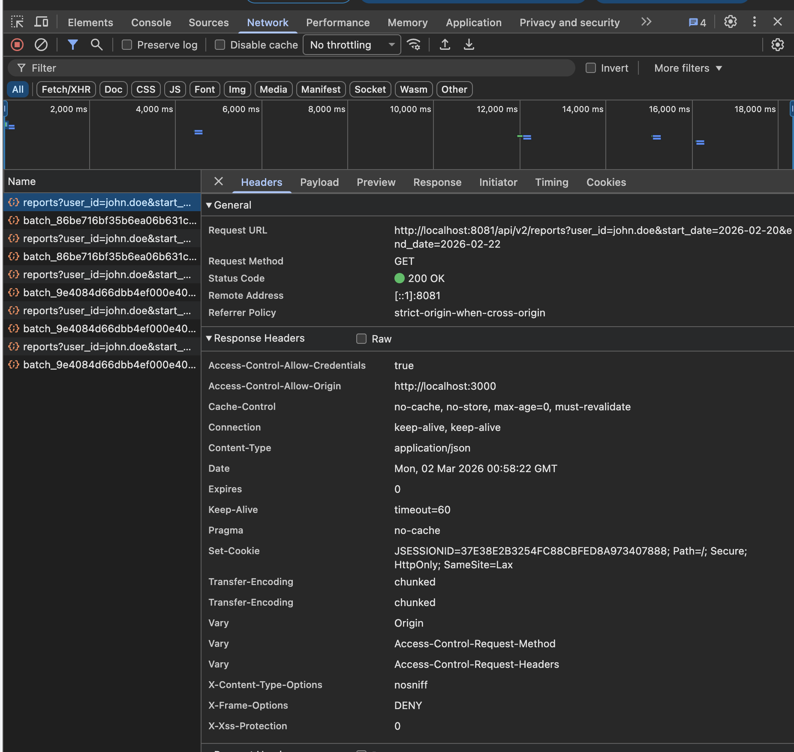
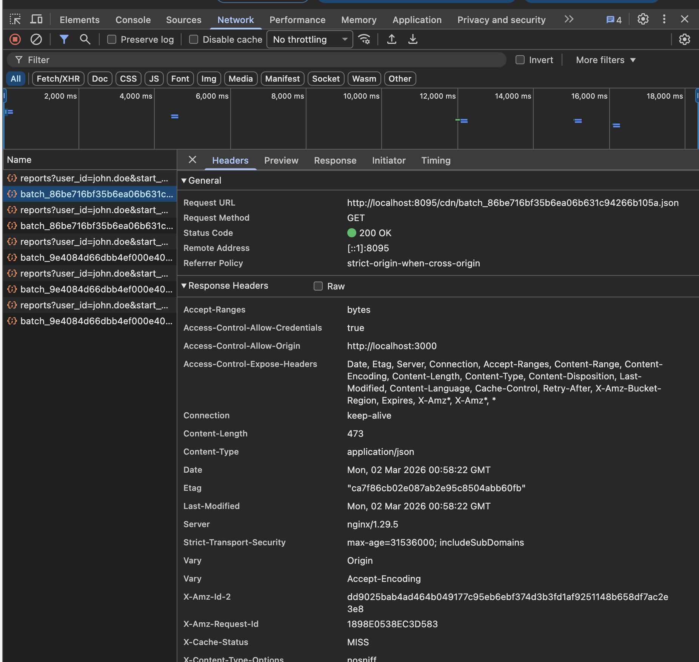
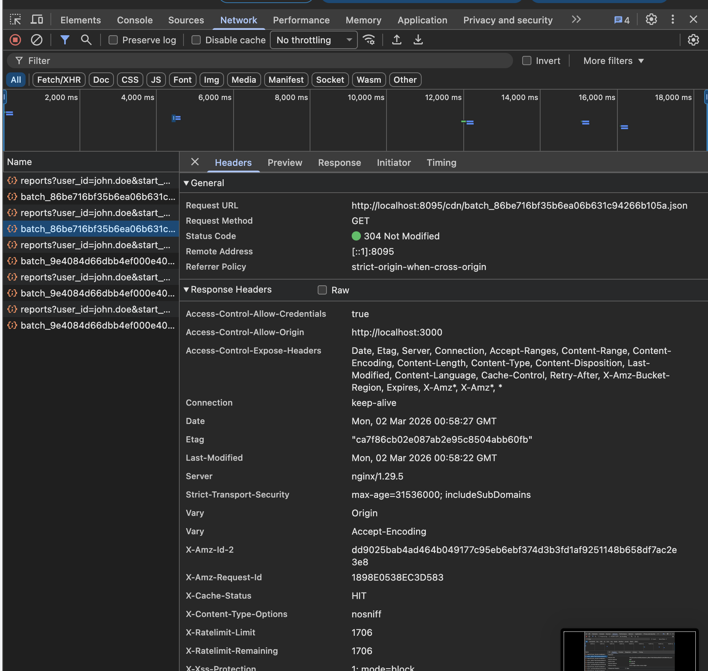
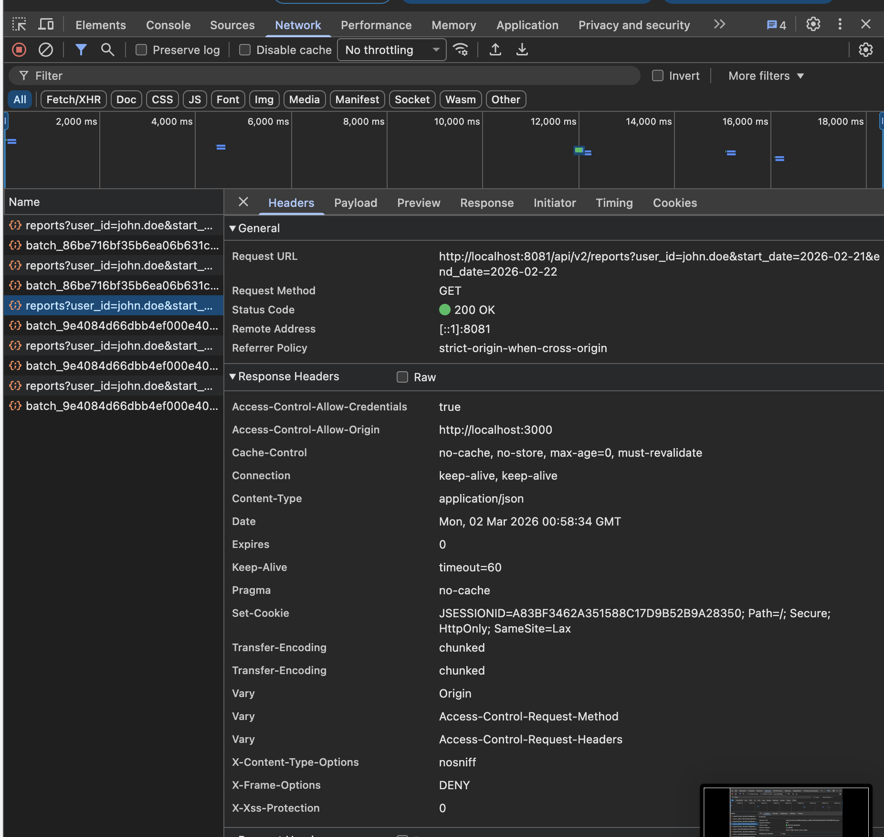
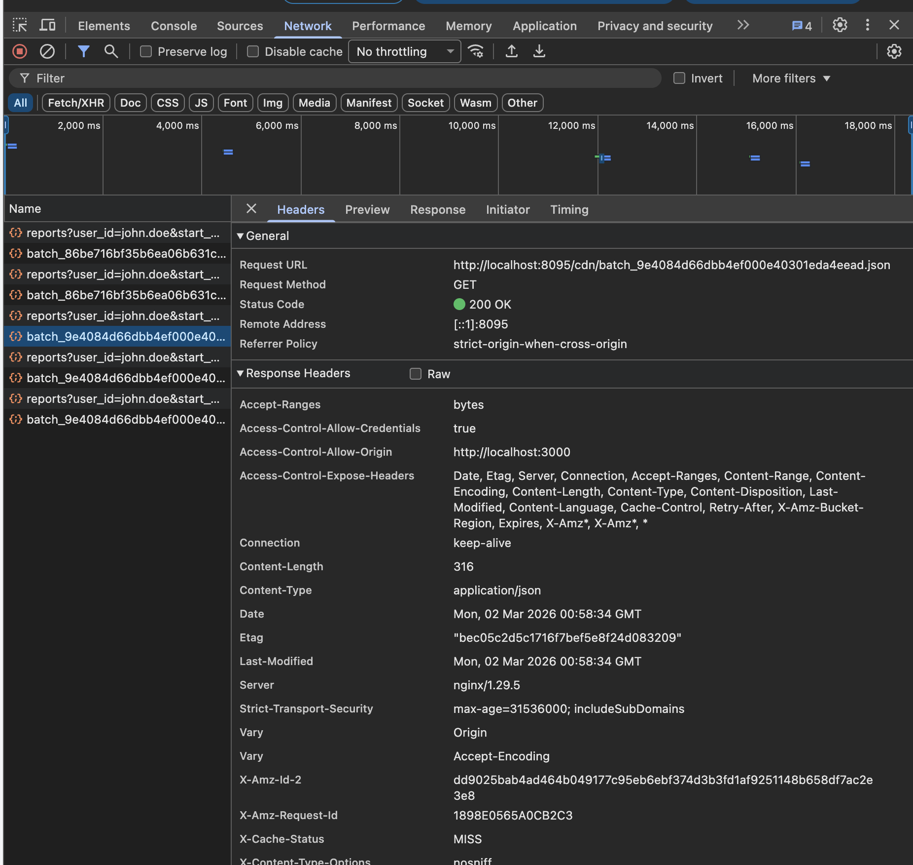
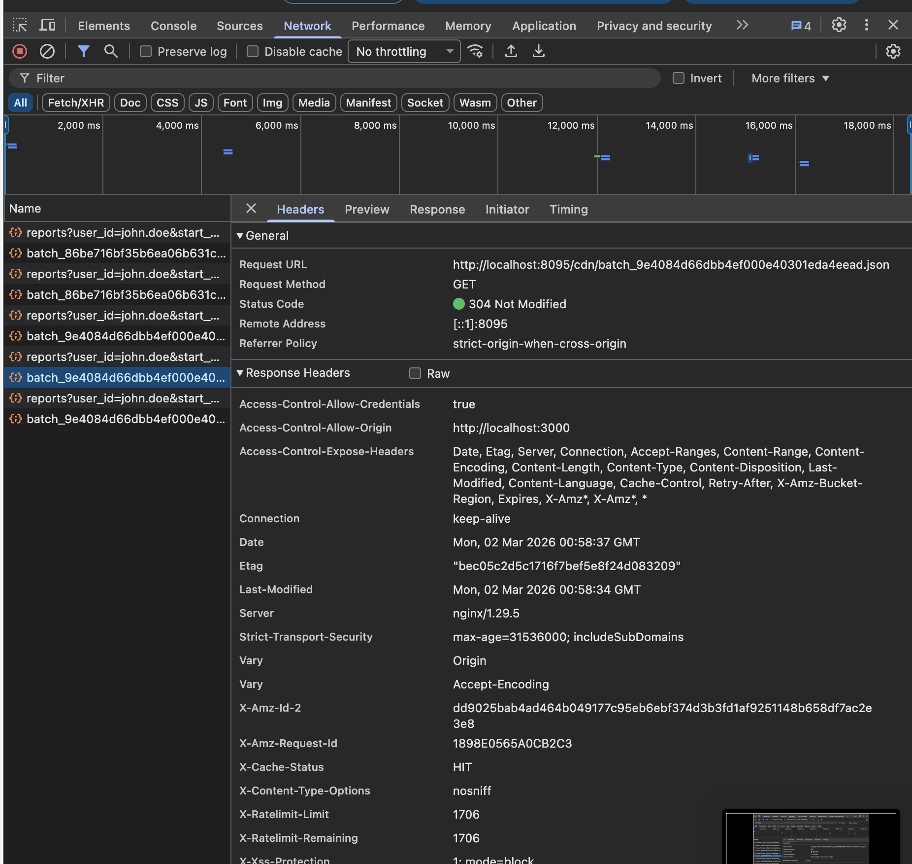

## Задание 3. Снижение нагрузки на базу данных
>
>После внедрении фичи о получении пользовательской отчётности нагрузка на базу данных отчётности существенно возросла. Пользователи стали часто запрашивать свои отчёты. Но поскольку данные обновляются с помощью ETL-процесса по расписанию, на эти запросы пользователи получают одинаковые отчёты.
>
>Ваша задача — во-первых, снизить нагрузку на OLAP-базу, исключив необходимость повторных запросов для уже сформированных отчётов, а во-вторых, разработать механизм, который будет сохранять отчёты по пользователям в объектное хранилище S3 и раздавать их через CDN.
>
>#### **Что нужно сделать**
>
>1. Добавьте в API-сервис реализацию записи сформированных отчётов в объектное хранилище, поддерживающее S3 API (Ceph, Minio). Конфигурация развёртывания Minio находится в репозитории спринта.
>2. При запросе отчёта сервис сначала проверяет наличие отчёта в S3. Если он там есть, то отдаёт ссылку на CDN. Если же отчёт не обнаружен, сервис должен его сгенерировать, положить в S3 и отдать ссылку на CDN в ответе. Для эмуляции CDN необходимо поднять и настроить Nginx как reverse proxy c включённым кешированием статических файлов.
>3. Продумать механизм обновления кеша в CDN и структуру хранения отчётов в S3 для быстрого доступа.
>
>#### Как сдать задание?
>1. Добавлен в сервис API код схемы взаимодействия с S3 и CDN, указанной в задании.
>2. Добавлен файл конфигурации Nginx с настройками reverse proxy в отдельную папку nginx.
>3. Добавлен в docker-compose файл конфигурации развёртывания Nginx.

### 1. ADR 09: Снижение нагрузки на OLAP DWH через внедрение CDN

####  Контекст
- После внедрения функции пользовательской отчетности значительно возросла нагрузка на аналитическую базу данных (ClickHouse). Пользователи часто запрашивают свои отчеты (за определенный период), при этом сами данные обновляются редко — только в момент срабатывания фонового ELT-процесса (DAG в Airflow). 
- Выполнение тяжелых агрегационных SQL-запросов на каждый клик пользователя неэффективно и расходует ресурсы базы данных впустую. 
- Требуется внедрить кэширующий слой с использованием S3-совместимого хранилища (MinIO) и эмулятора CDN (Nginx) для раздачи сформированных JSON-отчетов как статических файлов.

#### 1.1 Решение
- Внедрена гибридная архитектура кэширования статики (Cache Busting) с использованием MinIO в качестве персистентного S3-хранилища и Nginx в роли кэширующего reverse proxy. 
- Реализована новая версия API `/v2/reports`, которая вместо генерации и отдачи "тяжелых" данных возвращает клиенту безопасную ссылку на статический файл в CDN.

#### 1.1.2 Общая архитектура и роли компонентов
- **MinIO (S3 API):** Выступает в роли надежного объектного хранилища. Хранит готовые JSON-отчеты.
- **Nginx (CDN):** Выступает в роли эмулятора Content Delivery Network (Edge-узла). Перехватывает запросы фронтенда на отдачу файлов отчетов `/cdn`, проксирует их в MinIO и кэширует результаты на диске и в оперативной памяти.
- **BFF (ProxyController):** Маршрутизирует новые запросы фронтенда (`/api/v2/reports/**`) к целевому бэкенду, пробрасывая токен авторизации Keycloak.

#### 1.1.3 Последовательность действий (HIT/MISS сценарии)
- Фронтенд реализует двухшаговую загрузку: сначала запрашивает URL отчета у бэкенда, затем скачивает сам файл по полученному URL.

- **Cache Miss (Первичный запрос):**
  1. Бэкенд запрашивает у БД "легкую" агрегацию `MAX(updated_at)` для заданного пользователя и диапазона дат.
  2. Бэкенд генерирует имя файла (хеш). Делает под капотом быстрый `HEAD`- запрос в MinIO. Файла нет.
  3. Бэкенд делает `SELECT` в ClickHouse в витрину, собирает полный отчет.
  4. Бэкенд загружает JSON-файл в MinIO через S3 API и возвращает фронтенду ссылку (например, `{"url":"http://localhost:8095/cdn/batch_2f3aba87129431d3c89f769b96b28f98.json"}`).
  5. Фронтенд делает GET-запрос по ссылке. Запрос попадает в Nginx(CDN).
  6. Nginx(CDN) не находит файл в кэше, проксирует запрос в MinIO, скачивает файл, сохраняет его в свою директорию `/var/cache/nginx` и отдает фронтенду с заголовком `X-Cache-Status: MISS`.
- **Cache Hit (Вторичный запрос):**
  1. Бэкенд запрашивает у БД "легкую" агрегацию `MAX(updated_at)` для заданного пользователя и диапазона дат.
  2. Бэкенд генерирует имя файла (хеш).
  3. Бэкенд делает под капотом быстрый `HEAD`- запрос в MinIO, видит, что файл в MinIO уже есть, и мгновенно возвращает ту же самую ссылку.
  4. Фронтенд запрашивает файл у Nginx(CDN).
  5. Nginx(CDN) находит файл в своем локальном кэше и отдает его мгновенно с заголовком `X-Cache-Status: HIT`, вообще не обращаясь к S3 и базе данных.

#### 1.1.4 Формирование имени файла (Security и SALT)
- Если называть файлы предсказуемо (например, `user1_2026-02-20.json`), возникает уязвимость IDOR (Insecure Direct Object Reference) — злоумышленник сможет перебирать имена и качать чужие отчеты.
- **Решение:** 
  - Имя файла генерируется как префикс `batch_` (в 4 задании появится префикс `stream_`) + SHA-256 хеш от комбинации: `user_id` + `start_date` + `end_date` + `MAX(updated_at)` + `REPORT_LINK_SALT`.
  - Соль (`REPORT_LINK_SALT`) хранится в секретах приложения (переменные окружения) и защищает хеши от реверс-инжиниринга. Хеш выступает как Capability URL (ненаблюдаемый токен доступа).

#### 1.1.5 Стратегия инвалидации кэша (Cache Busting)
- основная стратегия: стратегия изменения URL вместо сложных механизмов очистки кэша по API (Purge) .
  - Когда Airflow ETL пересчитывает витрину данных, поле `updated_at` в ClickHouse обновляется на текущее время.
  - При следующем запросе бэкенд извлекает новое значение `MAX(updated_at)` и генерирует **совершенно новый хеш/URL**.
  - Фронтенд идет в Nginx по новому URL. Nginx воспринимает это как новый файл (Miss) и скачивает свежий отчет из S3. 
- дополнительная стратения: LRU в nginx; старые неиспользуемые файлы постепенно удаляются из Nginx по истечении времени (`inactive=7d`).

#### 1.1.6 Конфигурация Nginx и заголовки
Nginx настроен как reverse proxy для S3 (`proxy_pass http://minio:9000`).

- `proxy_cache_path ... keys_zone=reports_cache:10m max_size=1g`: выделяет 10 МБ в RAM для индексов ключей и 1 ГБ на диске для самих JSON-отчетов.
- `proxy_ignore_headers Cache-Control Expires`: директива, заставляющая Nginx принудительно кэшировать файлы на 7 дней (`proxy_cache_valid 200 7d`), даже если MinIO отдает запрещающие кэш заголовки по умолчанию.
- `add_header X-Cache-Status $upstream_cache_status`: добавляет служебный заголовок для дебага (позволяет видеть Hit/Miss в браузере).
- На проде реальный CDN (например, Cloudflare) работает по схожему принципу: узлы (Edge Servers) разбросаны по миру, кэшируют статику в памяти/на SSD и валидируют срок жизни файлов по HTTP-заголовкам.

#### 1.1.7 Технические нюансы стенда
- В `build.gradle` добавлены зависимости `io.minio:minio` для работы с S3 и `spring-boot-starter-json` для сериализации.
- В `docker-compose3.yml` добавлены контейнеры `minio`, `nginx-cdn` и `minio-setup` (утилита для автоматического создания публичного бакета `reports` при старте стенда); **что делает скрипт minio-setup** в контейнере?
  - он использует консольную утилиту mc (MinIO Client). Ждет 5 секунд, пока поднимется основной сервер, подключается к нему, создает бакет reports (`mc mb`) и делает его публичным для скачивания (`mc anonymous set download`);
  - это избавляет нас от необходимости каждый раз заходить в админку MinIO и настраивать права руками после пересоздания контейнеров;
- На фронтенде (`ReportPage.tsx`) добавлены новые кнопки для явного вызова v1 (прямой запрос) и v2 (через CDN), работающие с одной и той же таблицей для обратной совместимости.

#### 1.2 Последствия (обоснование)
- **Плюсы**:
  * Драматическое снижение нагрузки на ClickHouse: относительно тяжелые запросы (выборка отчета) к витрине выполняются только один в момент создания нового отчета, сохраняются только регулярные легкие вопросы (проверка сессии `SELECT MAX(updated_at) FROM daily_user_reports WHERE ...`).
  * Увеличение скорости ответа для пользователей: файлы скачиваются со скоростью отдачи статики из оперативной памяти/SSD Nginx.
  * Изящная и безопасная инвалидация кэша: Cache Busting через `updated_at` гарантирует, что пользователь никогда не получит устаревшие данные, а управление кэшем не требует написания сложной логики ручной очистки Nginx.
  * Защита данных: длинные salted-хеши делают подбор ссылок на чужие отчеты невозможным.
- **Минусы**:
  * Усложнение архитектуры инфраструктуры (появились компоненты S3 и Nginx, требующие мониторинга).
  * Незначительный оверхед по дисковому пространству в MinIO и Nginx из-за хранения "брошенных" старых версий отчетов, пока они не будут удалены по LRU/TTL политикам.

    
#### 1.3 Возможные альтернативы (в рамках задания)
#### 1.3.1 Кэширование JSON прямо в Redis (In-memory cache)
  - *Отличие:* Сохранять сформированный JSON не в MinIO/S3, а в Redis, и отдавать бэкендом напрямую.
  - *Почему не выбрано:* 
    - Задание явно требует реализации связки S3 + CDN. 
    - Кроме того, хранить огромные текстовые JSON-отчеты в оперативной памяти (Redis) экономически менее целесообразно, чем раздавать их как статику через Nginx/Edge-серверы, которые оптимизированы именно для стриминга файлов (Zero-copy).

#### 1.3.2 Активная инвалидация (Nginx Purge API) вместо Cache Busting
* *Отличие:* Использовать предсказуемые имена файлов (`/reports/user_date.json`) и отправлять команду `PURGE` в Nginx при каждом пересчете витрины.
* *Почему не выбрано:* 
  - Требует Nginx Plus (или кастомных модулей), создает жесткую связность между бэкендом/Airflow и конфигурацией кэширующего узла. 
  - Изменение URL (Cache Busting) работает детерминированно, stateless и "из коробки" в любом бесплатном Nginx/CDN.

### 2. Запуск и тестирование
1. Стартовать контейнеры:
    - `docker compose -f docker-compose3.yml up --build -d`;
    - `docker compose -f airflow/docker-compose.yml up --build -d`;
2. Убедиться, что настроены коннекшены airflow к OLAP и OLTP хранилищам (см. [TASK2_README.md](../task2/TASK2_README.md)):
3. Следует убедиться, что данные из oltp хранилища корректино загрузились в `clickhouse`, а затем правильно рассчиталась витрина.
4. Авторизоваться под одним из `ldap` пользователей из провести тесты (кроме `sarah.connor`, которая не имеет доступа к отчетам).
5. Минимум дважды вытащить отчеты за период 20-22 февраля (данные по умолчанию инициализированы за 20-22 февраля) по кнопке `Get Report v2 (CDN OLTP batch)` ;
    - увидеть запросы с фронта на `nginx-cdn` (`localhost:8095/cdn/batch_123`) по ссылке ответа ручки `v2/reports`;
    - первый запрос с таким пользователем и периодом должен быть MISS, второй и последующие - HIT, можно посмотреть на время запросов;
    - 
    - 
    - 
6. Минимум дважды вытащить отчеты за другой период, допустим 20-21 февраля, по кнопке `Get Report v2 (CDN OLTP batch)` ;
    - увидеть запросы с фронта **на новый файл** в `nginx-cdn` (`localhost:8095/cdn/batch_456`) по ссылке ответа ручки `v2/reports`;
    - первый запрос с таким пользователем и периодом должен быть MISS, второй и последующие  - HIT, можно посмотреть на время запросов;
    - 
    - 
    - 
