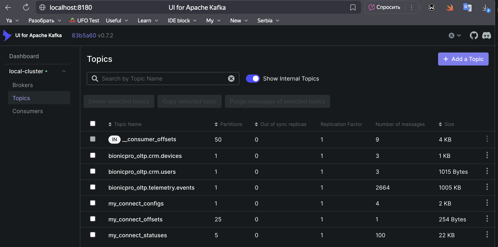
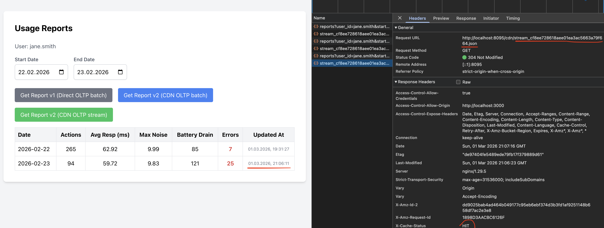
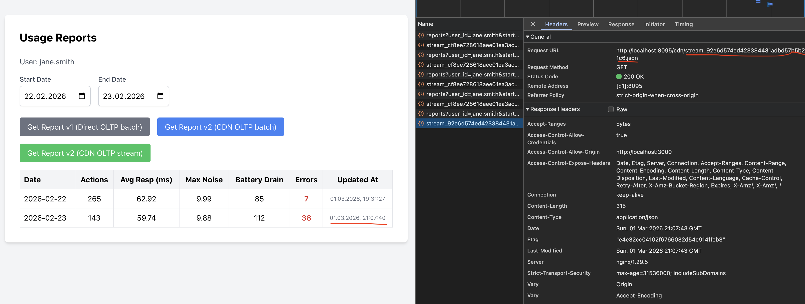
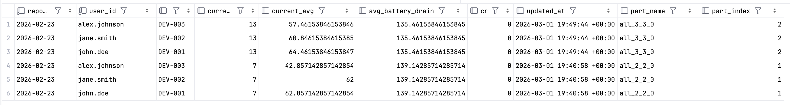

## Задание 4. Повышение оперативности и стабильности работы CRM
>
>База данных CRM увеличилась, и выполнение запросов на массовую выгрузку данных стало приводить к значительной нагрузке на систему. Это негативно сказывается на работе OLTP-запросов: они замедляются и часто завершаются ошибками. Это, в свою очередь, влияет на оперативность и стабильность работы CRM.
>
>Ваша задача — обеспечить разделение потоков операций: запросы на выгрузку не должны влиять на транзакционные операции в CRM.
>
>#### **Что нужно сделать?**
>
>1. Реализуйте механизм Change Data Capture (CDC) для отслеживания изменений в таблицах БД CRM. В качестве инструмента CDC используйте Debezium. С теорией по Debezium вы можете ознакомиться в спринте 8, теме 2, уроке 4. С документацией Postgres Debezium Connector вы можете ознакомиться [в статье на официальном сайте](https://debezium.io/documentation/reference/stable/connectors/postgresql.html).
>2. Настройте Debezium на отправку данных в топик Kafka.
>3. Настройте приём данных из топика Kafka в OLAP БД Clickhouse с помощью механизма KafkaEngine.
>4. Подготовьте витрину для отчётности, объединив данные при помощи MaterializedView в Clickhouse.
>5. Переведите сервис API на новую витрину.
>
>#### Как сдать задание?
>1. Добавлен файл конфигурации развёртывания Kafka и kafka-connect в docker compose.
>2. Добавлен файл конфигурации debezium-connector захвата данных из БД CRM в папку debezium.
>3. Добавлены скрипты приёма данных через механизм KafkaEngine и код создания MaterializedView для витрины в Clickhouse.

---
### 1. ADR 10: стратегия внедрения CDC для формирования Near-Real-Time (NRT) аналитики

**Контекст:**
- В задании идет речь о необходимости перекачки в OLAP таблиц CRM в потоковом режиме вместо батчевого. 
- Из задания неясно было, почему репликация через `airflow` по идее относительно небольших CRM словарей, могла вызвать столь большой рост нагрузки нагрузку на базу CRM.
- Для более реалистичной задачи показалось важным рассмотреть необходимость перевода на `CDC` репликации таблицы событий телеметрии; 
  - потоки изменений телеметрии, очевидно, гораздо объемней, чем измения справочников, 
  - также изменение отчетов по протезам в первую очередь ценее триггерить при появлении новых сигналов, чем изменении версии устройства в словаре (как-будто).
- Поэтому можно предположить, что еще одним функциональным требованием, обоснующим, переход репликации таблицы телеметрии на `CDC`, могла бы стать необходимость строить отчеты **Near-Real-Time (NRT)**;

**Поэтому** будем внедряем CDC-пайплайн на базе **Debezium + Kafka + ClickHouse**, но расширяем скоуп первоначального задания: переводим на потоковую обработку **не только таблицы CRM, но и телеметрию**.

**Решение. Детали технической реализации на стенде:**:

1. **Инфраструктура (Docker):** Добавлен брокер Kafka (kraft без zookeeper) и сервис Debezium. Создан `debezium_init` контейнер, который при старте стенда автоматически отправляет JSON-конфиг коннектора в Debezium API. В PostgreSQL включена логическая репликация (`wal_level = logical`).
2. **Слои ClickHouse:** 
   - **«Розетки» (Kafka Engine):** Таблицы, которые только вычитывают данные из Kafka ([/clickhouse-cdc/cdc_stages.sql](../../clickhouse-cdc/cdc_stages.sql); пример:
     - ```sql 
       create table bionicpro_olap.staging_telemetry_v2(
         event_id         UInt64,
         device_id        String,
         event_ts         DateTime64(6),
         action_type      String,
         response_time_ms Int32,
         myo_noise_level  Float32,
         battery_level    Int32,
         has_error        UInt8
       ) engine = ReplacingMergeTree ORDER BY (toDate(event_ts), device_id, event_id)
        ```
   - **Staging-таблицы:** По-прежнему нужны для хранения "сырых" реплик (`ReplacingMergeTree`), содаются v2 версии, просто чтобы сохранить обратную совместимость 1 версии витрины; **нюанс:** таблица `staging_telemetry_v2` формально не используетстся для построения новой витрины, но может пригодиться потом при пересчетах витрины;
   - **Потоковая витрина v2:** Новая таблица `daily_user_reports_v2` на движке `AggregatingMergeTree`:\
      -  ```sql   
         CREATE TABLE IF NOT EXISTS bionicpro_olap.daily_user_reports_v2 (
            report_date Date,
            user_id String,
            user_full_name String,
            device_id String,
            device_model_name String,
            total_actions AggregateFunction(count, UInt32),
            avg_response_ms AggregateFunction(avg, Int32),
            max_noise_level AggregateFunction(max, Float32),
            avg_battery_drain AggregateFunction(avg, Int32),
            critical_errors AggregateFunction(sum, UInt8),
            updated_at SimpleAggregateFunction(max, DateTime)
         ) ENGINE = AggregatingMergeTree()
         ORDER BY (user_id, device_id, report_date, user_full_name, device_model_name);
         ```
   - **Materialized Views («Насосы»):** Перекачивают и трансформируют данные.
     - ```sql
         CREATE MATERIALIZED VIEW IF NOT EXISTS bionicpro_olap.mv_daily_user_reports
         TO bionicpro_olap.daily_user_reports_v2 AS
         SELECT
         toDate(toDateTime64(t.event_ts / 1000000.0, 6)) AS report_date,
             u.id AS user_id,
             u.full_name AS user_full_name,
             t.device_id AS device_id,
             d.model_name AS device_model_name,
             -- Функции с суффиксом State подготавливают данные для AggregatingMergeTree
             countState(toUInt32(1)) AS total_actions,
             avgState(t.response_time_ms) AS avg_response_ms,
             maxState(t.myo_noise_level) AS max_noise_level,
             avgState(t.battery_level) AS avg_battery_drain,
             sumState(t.has_error) AS critical_errors,
             now() AS updated_at
         FROM bionicpro_olap.kafka_telemetry_stream AS t
         -- Джойним сырой поток с надежно сохраненными справочниками
         LEFT JOIN bionicpro_olap.staging_devices_v2 AS d ON t.device_id = d.device_id
         LEFT JOIN bionicpro_olap.staging_users_v2 AS u ON d.user_id = u.id
         GROUP BY report_date, user_id, device_id, full_name, model_name;
       ```
     - инициация пересчета витрины происходит только при появлении новых событий в розетке `kafka_telemetry_stream`;
3. **API** 
   - Для сохранения обратной совместимости в ручку `/api/v2/reports` добавлен опциональный параметр `stream=false`. 
   - Контроллер и репозиторий динамически выбирают, из какой витрины (старой батчевой или новой потоковой) читать данные.
   - для файлов добавился prefix `batch_/stream_` в зависимости от того из какой витрины его формируем;
4. **Frontend**: На фронтенде добавлены три кнопки: "Get Report v1 (Direct OLTP batch)", "Get Report v2 (CDN OLTP batch)", "Get Report v2 (CDN OLTP stream)".
5. **Настройки Postgres**: Запуск с настройками, разрешающими логическую репликацию.
   ```shell
         "postgres",
         "-c", "wal_level=logical",
         "-c", "max_replication_slots=4",
         "-c", "max_wal_senders=4"
   ```

**Последствия (обоснование):**
   * **Плюсы**:
     * **Изоляция нагрузки (Zero-impact):** OLTP-база больше не участвует в аналитических расчетах. Debezium читает WAL (Write-Ahead Log) асинхронно.
     * **Near-Real-Time (NRT) отчетность:** Условие перевода только CRM на CDC — скорее учебное упрощение. В реальности ценность потоковой обработки раскрывается, когда мы видим данные о телеметрии в отчетах с задержкой в секунды, а не на следующий день.
     * **Наличие сырого слоя (Staging):** Сохранение `staging` таблиц позволяет в любой момент пересобрать сломанную витрину или добавить новые метрики, не нагружая PostgreSQL повторной выгрузкой.
     * **Бесшовная миграция:** Сохранена обратная совместимость API, клиенты могут переходить на NRT-витрину постепенно.
   * **Минусы (и нюансы эксплуатации)**:
     * **Утечки WAL (WAL Bloat):** 
       - Если Kafka или Debezium упадут, PostgreSQL будет бесконечно копить WAL-файлы в репликационном слоте. 
       - Это приведет к исчерпанию места на диске и падению мастера. Требуется строгий мониторинг размера слота.
     * **Сложность инфраструктуры:** Появляются новые точки отказа (Kafka, Debezium, Zookeeper/KRaft).
     * **Особенности дедупликации:** 
       - Потоковая обработка работает по семантике *At-Least-Once*. Из-за ретраев в Kafka могут появляться дубли. 
       - В ClickHouse движок `ReplacingMergeTree` (в Staging) уберет дубли при фоновом слиянии, но `AggregatingMergeTree` в витрине посчитает дубль как новое событие (сумма удвоится).
     * **Необходимость DAG-оркестрации:** 
       - Из-за возможных дублей и ошибок логики чисто потоковая обработка уязвима. 
       - В реальных системах NRT-поток часто дополняют ночным батчевым пересчетом (Лямбда-архитектура) через Airflow (DAGs) с использованием идемпотентных операций или полной перезаписью партиций (Drop Partition -> Insert из Staging).

**Расширенное обоснование архитектуры (Deep Dive):**

1. **Природа Materialized Views в ClickHouse:**
   - В отличие от PostgreSQL, где MV — это кэшированный слепок данных (таблица), в ClickHouse MV — это **триггер на вставку (insert trigger)**. 
   - Как только сообщение попадает в «розетку» (`Kafka Engine`), MV срабатывает, трансформирует микробатч и кладет его в целевую таблицу. 
   - Если к одной розетке привязано несколько MV (например, одна в Staging, другая в Витрину), данные разлетятся параллельно.
2. **Кто должен триггерить витрину?**
   - Витрина строится на лету с помощью Stream-Table Join (`LEFT JOIN staging_devices`). 
   - Триггером (источником потока) должна выступать **телеметрия**, а не события CRM. 
   - Телеметрия — это быстрорастущая таблица фактов, пользователи и устройства (CRM) — это медленно меняющиеся измерения (SCD). 
   - Когда летит событие телеметрии, ClickHouse подхватывает его, идет в `staging` устройств, обогащает `user_id`,`device_id` и пишет результат в витрину.
3. **Нюансы `AggregatingMergeTree` и микробатчей:**
   - При NRT-загрузке данные поступают микробатчами. Если юзер сделал 10 действий за минуту, они могут прилететь 10-ю отдельными кусками (`parts`).
   - Движок `AggregatingMergeTree` сохраняет не конечные числа, а **состояния (States)** агрегации в бинарном виде (например, `countState`).
4. **Изменение контракта запросов:** 
   - Чтобы прочитать такие данные, обычный `SELECT *` не сработает (вернется бинарный мусор). 
   - Необходимо всегда использовать функции с суффиксом `-Merge` (например, `sumMerge`, `maxMerge`) и обязательный `GROUP BY`. 
   - Для просмотра сырых стейтов микробатчей при дебаге используется функция `finalizeAggregation()`. 
   - Со временем ClickHouse запустит фоновый процесс (Merge), который склеит эти микробатчи в одну итоговую строку для каждого ключа.

**Возможные альтернативы (в рамках задачи):**

1. **Batch-выгрузки по расписанию (DAG/Airflow) + Polling (`updated_at`):** 
   - *Плюсы:* Нет проблем с дублями, проще инфраструктура.
   - *Минусы:* Нет NRT. Постоянный опрос базы (Polling) всё равно грузит PostgreSQL и пропускает жесткие удаления (Hard Deletes), так как удаленной строки с `updated_at` больше нет в таблице.

2. **Dual-Writes (Двойная запись из приложения):**
   * *Плюсы:* Не нужен Debezium. Бэкенд сам пишет в PG и кидает событие в Kafka.
   * *Минусы:* Высокий риск рассинхрона данных (отсутствие распределенной транзакции). Если запись в Kafka упадет, аналитика разойдется с базой (Out of sync). CDC надежнее, так как источником правды выступает транзакционный лог самой БД.

### 2. Запуск и тестирование
1. Остановить контейнеры из задания, airflow тоже можно оставить, т.к. airwlow не будет использоваться на стенде после перехода на CDC:
   - `docker compose -f docker-compose3.yml down`;
   - `docker compose -f airflow/docker-compose.yml down`;
2. Запуск контейнеров из нового конфига 4 без airflow:
   - `docker compose -f docker-compose4.yml up --build -d`;
   - дополнительно к контейнерам из задания 3 стартуют `kafka`, `kafka-ui`, `debezium_oltp`, `debezium_init` для запуска скрипта инициализации коннтектора дебезиум `postgres_oltp`;
3. После старта, необходимо проверить, что в `kafka`(http://localhost:8180) появились топики по 3 таблицам (`users, devices, events`), в которые `debezium` залил начальное состояние этих таблиц с эвентами для каждой строки.
   -   
4. Настроить таблицы для потоковой обработки и записи в витрины из скрипта [/clickhouse-cdc/cdc_stages.sql](../../clickhouse-cdc/cdc_stages.sql) по шагам:
   - a) cоздание staging потоковых таблиц `users, devices, events` (v2);
   - b) создать "розетки" для подключения к kafka;
   - c) создать насосы (MV) с накаткой данных через mv в `staging_devices_v2` и `staging_user_v2`;
   - d) создать новую потоковую витрину `daily_user_reports_v2`;
   - e) создать "насосы" (MV) для накатки данных в новую витрину и `staging_telemetry_v2`; выполнить скрипты одновременно, иначе в одну из таблиц данные могут не доехать;
   - **Примечание:** в общем случае для формирования витрины `staging_telemetry_v2`, но она позволит восстанавливать в случае сбоев сырых данных при расчете витрины и пересчитать ее позже;
5. Убедиться, что данные из oltp хранилища корректино загрузились в `staging_telemetry_v2` и `daily_user_reports_v2`.
6. Авторизоваться под одним из `ldap` пользователей из провести тесты (кроме `sarah.connor`, которая не имеет доступа к отчетам) с новой кнопкой `Get Report v2 (CDN OLTP stream)`: 
   - выбрать отчеты за разные периоды и убедиться, что все работает корректно (доступ, CDN, cache MISS, cache HIT);
   - используя скрипт генерации таблицы телеметрии из [/postgres_oltp-init/02-data.sql](../../postgres_oltp-init/02-data.sql), дописать немного данных, за какой-то из последних дней, например, за 2023-02-23;
   - повторить запрос через несколько минут и убедиться, что данные в  отчете изменились через CDC, равно как и время его генерации, а также ссылка на файл;
   -  
   - 
7. Можно подключиться к `clickhouse` и выполнить запрос (из [/clickhouse-cdc/cdc_search_scripts.sql](../../clickhouse-cdc/cdc_search_scripts.sql)), чтобы увидеть, что последний микробатч телеметрии еще не смерджен в потоковой витрине:
   - 

